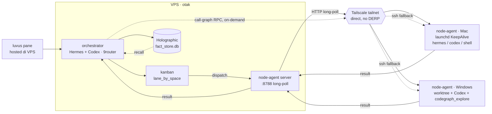

# node-agent — Otak di VPS, tangan di Mac/Windows lewat Tailscale

> agentic-flow-adit · rev 3

Orchestrator, kanban, dan memory (Holographic) tinggal permanen di VPS. Eksekusi kode jalan
di mesin lokal (Mac/Windows) lewat **node-agent** — koneksi persisten, bukan SSH tiap dispatch —
dengan SSH sebagai fallback kalau stream putus. Ini realisasi dari konsep **Spaces** yang udah
dirancang buat Hermes WebUI.

## Kenapa node-agent, bukan SSH tiap task

| Aspek | SSH per-dispatch | Node-agent (dipilih) |
|---|---|---|
| Koneksi | ~~handshake + auth ulang tiap task~~ | satu koneksi persisten, reconnect otomatis kalau putus |
| Arah koneksi | VPS → local (sering ke-block NAT/wifi kantor) | local dial keluar ke VPS (identitas tailnet stabil) |
| Transport | shell exec, teks mentah | HTTP long-poll JSON (pola sama kayak transport Go↔Hermes yang udah jalan) |
| Kalau koneksi mati | — | fallback otomatis ke SSH exec |

## Alur — VPS (otak) ↔ node-agent (tangan)



**Legend**

| | |
|---|---|
| **O** | plans + delegates, nulis ke & recall dari memory |
| **K** | assign task ke space (mac/windows) berdasarkan lane |
| **S** | node-agent server — `POST /api/dispatch` route by workspace prefix, agent long-poll |
| **NA** | node-agent — eksekusi di workspace lokal, `runJob` heuristic: shell fast-path → hermes → codex |
| **call-graph RPC** | orchestrator panggil langsung kapan aja — nggak nunggu kanban card |
| **T** | tailnet — pastiin direct via `tailscale ping`, bukan relay DERP |
| **M** | Holographic — fact_store.db, satu-satunya sumber konteks lintas mesin |

## Quick start

VPS (server):

```sh
cd ~/apps/node-agent
./ctl.sh build
./ctl.sh start          # pm2 node-agent :8788
curl http://127.0.0.1:8788/health
```

Mac (agent, launchd KeepAlive):

```sh
GOOS=darwin GOARCH=arm64 go build -o node-agent ./cmd/agent
scp node-agent adityahimawan@100.75.2.78:.hermes/bin/node-agent
ssh mac 'launchctl load ~/Library/LaunchAgents/com.adit.node-agent.plist'
```

Dispatch:

```sh
curl -X POST http://127.0.0.1:8788/api/dispatch -H 'Content-Type: application/json' \
  -d '{"task_id":"t1","board":"f8-saas","message":"git status","workspace":"/Users/adityahimawan/Development/saas"}'
curl http://127.0.0.1:8788/api/results/t1
```

## Workspaces

`~/.hermes/workspaces.json` (VPS+Mac synced) binds hermes kanban boards to luvus workspaces:

| id | path | apps |
|---|---|---|
| `root` | `/Users/adityahimawan/Development` | — |
| `saas` | `/Users/.../saas` | gadjian/app, portal-hadirr, baktiku-portal |
| `bisadaya` | `/Users/.../bisadaya-monorepo` | remote `git@dev.fast-8.com:bisadaya/bisadaya-monorepo.git` |

Helper `ws` CLI (`~/.hermes/bin/ws`):

```sh
ws list              # ID | STATUS connected/disconnected | ROUTE relay/direct | LUVUS | PATH
ws ping [id]         # ssh probe per workspace
ws open <id>         # luvus workspace open <path> on Mac + verify
ws status --json     # machine-readable
```

## runJob heuristic

Shell meta (`;`, `|`, `&&`) or CLI prefix (`git `, `ls `, `cat `, `echo `, `pwd`, `grep `, `find `…) → `bash -lc` fast (~50-100ms).
Otherwise task prompt → `hermes chat -q` (~25-60s) → `codex exec` fallback.

| test | kind | duration |
|---|---|---|
| `echo;pwd;ls gadjian` | shell | 44ms |
| `git branch --show-current` | shell | 90ms |
| `list files in current directory` | hermes | 57.7s |

## Install manifest

```json
{
  "manifest": [
    { "name": "hermes-agent",          "repo": "NousResearch/hermes-agent",        "role": "orchestrator",   "status": "installed" },
    { "name": "holographic-memory",    "repo": "bysc1000/holographic-memory",      "role": "memory-plugin",  "status": "installed" },
    { "name": "codex",                 "repo": "openai/codex",                     "role": "worker",         "status": "installed" },
    { "name": "9router",               "repo": "decolua/9router",                  "role": "model-router",   "status": "installed" },
    { "name": "luvus",                 "repo": "RizRiyz/luvus",                    "role": "multiplexer",    "status": "installed" },
    { "name": "ponytail",              "repo": "DietrichGebert/ponytail",          "role": "skill",          "status": "installed" },
    { "name": "caveman",               "repo": "JuliusBrussee/caveman",            "role": "skill",          "status": "installed" },
    { "name": "call-graph",            "repo": "colbymchenry/codegraph",           "role": "skill",          "status": "installed" },
    { "name": "worktrees",             "repo": "tanvesh01/issue-workflow",         "role": "skill",          "status": "skipped (repo empty)" },
    { "name": "node-agent",            "repo": "adityahimaone/node-agent",         "role": "custom",         "status": "installed (this repo)" }
  ]
}
```

## Skills — siapa jalan di mana

| Skill | Jalan di | Perannya |
|---|---|---|
| ponytail | node-agent, sebelum kirim hasil | saring dulu — kalau cukup `lru_cache`, jangan bikin kelas custom. Ngirit round-trip ke VPS |
| caveman `full` | payload hasil | hasil node-agent → orchestrator terse. Ngurangin ukuran payload lewat tailnet, bukan cuma hemat context |
| call-graph | node-agent (butuh akses codebase lokal) | `codegraph_explore` + LSP lokal, yang dikirim balik cuma graph terstruktur, bukan log traversal mentah |
| worktrees | node-agent | satu worktree per kanban card yang di-assign ke space itu — task paralel nggak tabrakan |
| luvus | VPS | kontrol pane, di-attach dari Mac/Windows/HP via Tailscale ssh |

## Bikin cepat — checklist Tailscale

1. `tailscale ping <mesin>` — pastikan "direct", bukan "via DERP". Kalau relay, cek `tailscale netcheck` buat NAT type.
2. Node-agent dial keluar ke VPS, bukan VPS masuk ke local — local machine biasanya di belakang NAT yang lebih ribet.
3. MagicDNS aktif — alamat pakai nama mesin, bukan IP tailnet yang bisa berubah.
4. HTTP plaintext di atas interface Tailscale — WireGuard udah encrypt, TLS tambahan cuma buang CPU/latency buat setup single-user.
5. Auto-reconnect dengan backoff di node-agent; orchestrator tandai space offline & switch ke SSH fallback kalau di atas threshold.

## Build

```sh
# VPS server
go vet ./... && GOMAXPROCS=1 GOGC=20 go build -o node-agent-server ./cmd/server

# Mac agent (dari VPS, cross-compile)
GOOS=darwin GOARCH=arm64 GOMAXPROCS=1 GOGC=20 go build -o node-agent ./cmd/agent
```

Stack: Go 1.23, chi, HTTP JSON long-poll (no protoc). pm2 di VPS, launchd di Mac, SSH alias `mac-tailscale` untuk file ops.

---

rev 3 — otak di VPS, tangan di node-agent (Mac/Windows), ssh fallback, no ollama, no opencode.
Design spec: [docs/agentic-flow-adit.html](docs/agentic-flow-adit.html)
