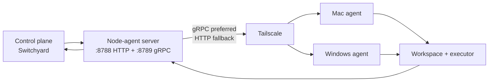
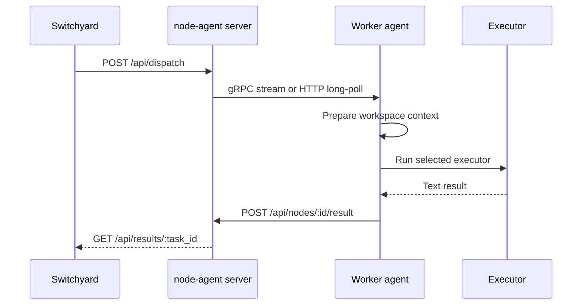

# node-agent

Worker service for running tasks on hosts that own the source code. The node-agent server runs on the VPS. Agents run on Mac or Windows. Agents open outbound connections to the VPS, so the VPS does not need inbound access to local machines.

This repository is the execution plane. [Switchyard](https://github.com/adityahimaone/switchyard) is the control plane: it stores task intent, selects a workspace and executor, then dispatches work to this service.

## Architecture





The server keeps the queue and results in memory. An agent registers, sends heartbeats, receives one job, executes it, and posts the result back. Switchyard remains responsible for board state, retries, review, commit, and push.

## Executors

| Executor | Binary | Mode | Notes |
|---|---|---|---|
| `hermes` | `hermes` | `hermes chat -q` | Uses `HERMES_WORKSPACE` |
| `codex` | `codex` | `codex exec --full-auto` | Non-interactive coding tasks |
| `dsh` | `dsh` | `--profile headless --json` | DeepSeek Harness session; isolated `DSH_HOME` |
| `commandcode` | `cmd`, `cmdc`, or `command-code` | `-p ... --yolo` | `cmdc` is the Windows alias |
| `shell` | OS shell | `bash -lc` or `cmd /c` | `command` only; `body` is description — empty `command` rejected |
| `auto` | Available capability | Hermes, then Codex, then CommandCode | Compatibility mode |

The agent does not infer the shell from prompt contents. The dispatcher sends the executor explicitly. Shell supports `execution_mode=direct` (the `command` field is executed once) and `execution_mode=agentic` (a read-only planner selects one command at a time, the worker executes it through shell + RTK, and repeats within `max_iterations`). Agentic mode receives task intent in `message`; destructive command patterns are blocked and the final result remains review-gated by Switchyard.

### CommandCode

CommandCode runs through its headless CLI:

```sh
cmd -p "<prompt>" --yolo --skip-onboarding --output-format text
```

`--yolo` allows file edits and shell commands. Use this executor only on trusted nodes. The node-agent requests text output so task results stay readable.

References: [headless mode](https://commandcode.ai/docs/headless) and [CLI reference](https://commandcode.ai/docs/reference/cli).

### DeepSeek Harness

`dsh` runs the DeepSeek Harness headless profile on the workspace host:

```sh
dsh --profile headless --json
```

A continuation adds `--session-id <id>` and resumes the same session; the first
run omits it. The worker reads the session ID and cwd from the emitted `session`
event and fails the run with `dsh_session_missing` when `--json` produces no
session event, rather than reporting silent success.

`dsh` is a Node launcher and launchd starts the worker with a minimal `PATH`, so
the worker prepends `/opt/homebrew/bin` for every DSH invocation, including the
`--version` health check.

Agent runs use an isolated home (`~/.dsh-nodeagent`, overridable with
`NODE_AGENT_DSH_HOME`), keeping their session locks separate from the `dsh web`
daemon's. Finished sessions are mirrored back into `~/.dsh` and registered in
its workspace registry so `dsh web` can list them. Because DSH write handles are
`flock(2)` leases that the installed build never expires, retrying a conflict
does not help — isolating the home does.

Full contract, session identity rules, and troubleshooting:
[docs/dsh-harness.md](docs/dsh-harness.md).

## Register and capabilities

At startup the agent finds available binaries and sends capabilities:

```json
{
  "node_id": "mac",
  "hostname": "worker-mac",
  "version": "0.3.0",
  "workspaces": ["/Users/<user>/Development"],
  "executors": ["hermes", "codex", "dsh", "commandcode", "shell"],
  "versions": {"commandcode": "..."}
}
```

The server accepts an explicit executor only when it is advertised by the selected node. If multiple nodes provide the same workspace, executor capability is also used for selection.

## Dispatch API

All `/api/*` and `/dl/*` endpoints use `X-Node-Agent-Token` when token authentication is configured on both server and agent.

### Send an AI job

```sh
curl -X POST http://<VPS_TAILSCALE_IP>:8788/api/dispatch \
  -H 'Content-Type: application/json' \
  -H "X-Node-Agent-Token: <token>" \
  -d '{
    "task_id": "t1",
    "board": "saas",
    "message": "Fix login validation",
    "workspace": "/Users/<user>/Development/saas",
    "executor": "commandcode"
  }'
```

### Internal shell dispatch

Switchyard creates tasks with `executor: "shell"` and a dedicated `command`. The task dialog exposes `Shell Command` separately from the description; `body` never becomes the command:

```json
{
  "task_id": "t2",
  "board": "saas",
  "message": "generated by orchestrator",
  "workspace": "/Users/<user>/Development/saas",
  "executor": "shell",
  "command": "git status && pnpm test"
}
```

DSH dispatches carry session continuity fields. Switchyard sends
`dsh_workspace_id`, `dsh_session_id`, `last_turn_seq`, `last_comment_id`,
`run_id`, and `session_continuation`; the worker returns `dsh_workspace_id`,
`dsh_session_id`, and the highest consumed `last_turn_seq`:

```json
{
  "task_id": "t3",
  "board": "saas",
  "message": "Continue from the last review comment",
  "workspace": "/Users/<user>/Development/saas",
  "executor": "dsh",
  "dsh_session_id": "session-<uuid>",
  "session_continuation": true
}
```

See [docs/dsh-harness.md](docs/dsh-harness.md) for what the worker guarantees.

POST /api/dispatch body accepts `conversation_id`, `append_only`, and
`context_window`. When `conversation_id` is empty the agent resolves one per
workspace+executor. `append_only=false` clears history before the prompt.
The agent stores messages under `$HOME/.node-agent/conversations/*.json`.
Hermes receives context via prompt assembly; codex/commandcode remain
stateless for now.

Fetch the result:

```sh
curl -H "X-Node-Agent-Token: <token>" \
  http://<VPS_TAILSCALE_IP>:8788/api/results/t1
```

Result fields include `success`, `output`, `error`, and `duration_ms`. Dispatch acknowledgements may include `transport` and `delivery_id`; Switchyard uses them for flow diagnostics and idempotent result handling.

### Endpoints

| Method | Path | Purpose |
|---|---|---|
| GET | `/health` | Health and node list |
| GET | `/api/nodes` | Node capabilities and status |
| POST | `/api/nodes/register` | Register an agent |
| POST | `/api/nodes/{id}/heartbeat` | Update idle or busy state |
| GET | `/api/nodes/{id}/poll` | Long-poll for a job |
| POST | `/api/nodes/{id}/result` | Submit a job result |
| POST | `/api/dispatch` | Queue a job by workspace |
| GET | `/api/results/{task_id}` | Fetch a result |
| GET | `/api/workspaces` | Server workspaces and node status |
| GET | `/dl/mac` | Download the Mac binary |
| GET | `/dl/windows` | Download the Windows binary |

## Context and output optimization

Before starting an AI executor, the agent prepares context:

1. `ensureCodegraph(ws)` uses an existing `.codegraph/` index or runs `codegraph init` with a 60-second limit.
2. `PrequestNote` from Switchyard/workspace registry takes priority.
3. When the note is empty, the agent reads the first 100 lines of `AGENTS.md`, then `README.md`.
4. The final AI prompt combines prerequisites, codegraph status, and the task message.

Shell is a separate fast path:

- default: execute only `command` through `bash -lc` (or `cmd /c` on Windows);
- `body` is descriptive text and is never executed;
- empty/whitespace `command` is rejected by Switchyard and node-agent;
- `NODE_AGENT_SHELL_PREFLIGHT=1` exposes codegraph/prequest through `NODE_AGENT_CODEGRAPH_STATUS` and `NODE_AGENT_PREQUEST`, without changing command text;
- RTK rewrite runs within bounded 800 ms checks; `NODE_AGENT_SHELL_CAVEMAN=1` may compact output over 8 KiB with a 2-second fail-open cap.

The pipeline reduces model context through:

- codegraph — local structural index for AI executors;
- RTK — shell command/output reduction;
- caveman — optional shell result compression, gated by environment.

Codegraph failure is non-fatal. Jobs can run without an index. Shell preflight and output compaction are opt-in, not required for basic shell execution.

## Configuration

Server environment:

```sh
NODE_AGENT_ADDR=:8788
NODE_AGENT_GRPC_ADDR=:8789
NODE_AGENT_GRPC_ENABLED=1
NODE_AGENT_TOKEN=<shared-secret>
NODE_AGENT_DIST_DIR=./dist
```

Agent transport:

```sh
NODE_AGENT_TRANSPORT=auto             # auto | grpc | http
NODE_AGENT_GRPC_TARGET=<VPS_TAILSCALE_IP>:8789
```

`auto` prefers gRPC when `NODE_AGENT_GRPC_TARGET` is set. Connection or stream failure falls back to HTTP long-poll. `grpc` fails loudly when gRPC is unavailable. `http` forces compatibility mode. Phase 1 gRPC uses HTTP/2 with a JSON codec and shared token metadata. Keep port `8789` private to the tailnet.

Agent environment:

```sh
NODE_AGENT_SERVER=http://<VPS_TAILSCALE_IP>:8788
NODE_AGENT_TOKEN=<shared-secret>
NODE_AGENT_ID=mac
NODE_AGENT_JOB_TIMEOUT=600
NODE_AGENT_NO_RTK=1
```

`NODE_AGENT_NO_RTK=1` disables `rtk` rewriting for shell executors. Without it, the agent tries `rtk hook check` and then `rtk rewrite`, each with an 800 ms limit, and uses the original command when rewriting fails. The executable name remains `rtk`.

DeepSeek Harness variables:

```sh
NODE_AGENT_DSH_HOME=$HOME/.dsh-nodeagent   # isolated session home (default)
NODE_AGENT_DSH_PUBLISH=0                   # skip mirroring sessions into ~/.dsh
NODE_AGENT_DSH_WORKSPACE_REGISTRATION=0    # skip workspace registry writes
NODE_AGENT_DSH_WEB_URL=http://127.0.0.1:3080/
NODE_AGENT_DSH_CONFLICT_RETRIES=30
NODE_AGENT_DSH_CONFLICT_DELAY_MS=1000
```

Leave `NODE_AGENT_DSH_HOME` unset to keep the default isolated home. Do not
point it at `~/.dsh` — that restores the lock contention with `dsh web`.

The token must match on the server and every agent. Store it in `~/.hermes/node-agent.env` with file mode `0600`.

## Install the server on the VPS

```sh
cd ~/apps/node-agent
./ctl.sh build
NODE_AGENT_TOKEN=<token> ./ctl.sh start
curl -H "X-Node-Agent-Token: <token>" http://<VPS_TAILSCALE_IP>:8788/health
```

`ctl.sh` also cross-builds worker binaries and serves them through `/dl/mac` and `/dl/windows`.

## Install the Mac agent

VPS server upgrades do not replace the agent binary running on Mac. Install the Mac worker separately:

```sh
NODE_AGENT_TOKEN=<same-token-as-VPS> ./scripts/install-mac.sh
```

The installer downloads the binary, writes a KeepAlive LaunchAgent, and verifies registration.

## Install the Windows agent

```powershell
cd C:\Users\<user>\apps\node-agent
$env:NODE_AGENT_TOKEN = "<same-token-as-VPS>"
.\scripts\install-windows.ps1
```

The installer uses a Scheduled Task at logon and a supervisor to restart the binary when it exits. The Windows CommandCode alias is `cmdc`; `cmd` is the built-in command shell.

## Workspace routing

The server matches task paths against prefixes advertised by agents:

- `/Users/...` usually routes to a Mac node;
- `C:\...` usually routes to a Windows node;
- when multiple nodes share a workspace, executor capability filters the candidates;
- when no workspace matches, `auto` may select the first online node.

Agent workspaces are read from `~/.hermes/workspaces.json`:

```json
{"workspaces": [{"path": "/Users/<user>/Development"}]}
```

Switchyard uses the same file as its workspace source of truth. Keep workspace IDs, host, OS, notes, and unknown metadata intact when editing it.

## Timeout and status

Default job timeout is 600 seconds. Timed-out jobs are cancelled and returned as failures. Heartbeats use `idle` or `busy` so the server does not send work to a busy agent.

The agent never commits or pushes as part of a Switchyard dispatch. Switchyard fetches the diff and performs approval through its review gate.

## Build and test

Server and worker builds are separate. Building on the VPS does not replace an agent binary already running on Mac or Windows.

```sh
go test ./...
go vet ./...

go build -o node-agent-server ./cmd/server

GOOS=darwin GOARCH=arm64 go build -o dist/node-agent-darwin-arm64 ./cmd/agent
GOOS=windows GOARCH=amd64 go build -o dist/node-agent-windows-amd64.exe ./cmd/agent
```

## Troubleshooting

### `401 unauthorized`

Verify `NODE_AGENT_TOKEN` matches on server and agent. Verify the client sends `X-Node-Agent-Token`.

### `executor unavailable on node`

Install the executor binary on the worker host and restart node-agent so registration capabilities refresh. Check `/api/nodes`.

### Node registered but workspace is not routed

Verify the path in `workspaces.json` is a prefix of the task path. Slash differences, drive-letter differences, or an incorrect parent workspace can prevent a match.

### CommandCode fails to start

Linux and macOS require `cmd` or `command-code`. Windows requires `cmdc` or `command-code`. Run `cmd --version`, `cmdc --version`, or `command-code --version` locally as the service user.

### `dsh_session_conflict`

Something else owns the session's DSH write handle — normally `dsh web` running
on the same home. Confirm the agent uses the isolated home
(`lsof -p <worker-pid> | grep session.lock`) instead of tuning retries.
`NODE_AGENT_DSH_CONFLICT_RETRIES` only buys time; it does not release a foreign
lock.

### `dsh_unavailable: DeepSeek Harness (dsh) not installed or not on PATH`

Install `@deepseek-ai/dsh` on the worker host and restart node-agent so
capabilities refresh. Verify with `dsh --version` under the minimal environment
launchd provides — `dsh` is a Node launcher and needs Homebrew on `PATH`.

### DSH sessions are missing from `dsh web`

Sessions live in the isolated home until the worker publishes them. Check that
`NODE_AGENT_DSH_PUBLISH` is not `0` and that the worker log shows
`dsh session publish: mirrored session ...`. A mirrored transcript without a
registry entry still does not appear — see
[docs/dsh-harness.md](docs/dsh-harness.md).

## Related repositories and references

- [Switchyard](https://github.com/adityahimaone/switchyard) — control plane, dispatcher, and review gate
- [CommandCode CLI reference](https://commandcode.ai/docs/reference/cli)
- [CommandCode headless mode](https://commandcode.ai/docs/headless)
- [DeepSeek Harness executor contract](docs/dsh-harness.md) — session identity, isolated home, publishing
- [RTK](https://github.com/rtk-ai/rtk) — command output reduction
- [Caveman](https://github.com/JuliusBrussee/caveman) — result compression target
