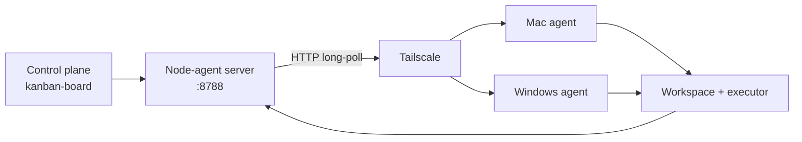

# node-agent

Worker service untuk menjalankan task pada host yang memiliki source code. Server node-agent berjalan di VPS, sedangkan agent berjalan di Mac atau Windows. Agent membuka koneksi keluar ke VPS, sehingga VPS tidak perlu membuka koneksi masuk ke mesin lokal.

Repository ini adalah execution plane. Kanban-board adalah control plane yang menyimpan task intent, memilih workspace dan executor, lalu mengirim dispatch ke server node-agent.

## Arsitektur



Server menyimpan queue dan result in-memory. Agent melakukan register, heartbeat, long-poll, eksekusi satu job, lalu POST result kembali.

## Executor

| Executor | Binary | Mode | Catatan |
|---|---|---|---|
| `hermes` | `hermes` | `hermes chat -q` | Memakai `HERMES_WORKSPACE` |
| `codex` | `codex` | `codex exec --full-auto` | Task coding non-interaktif |
| `commandcode` | `cmd`, `cmdc`, atau `command-code` | `-p ... --yolo` | `cmdc` adalah alias Windows |
| `shell` | shell OS | `bash -lc` atau `cmd /c` | Internal orchestrator dispatch |
| `auto` | capability yang tersedia | Hermes, lalu Codex, lalu Command Code | Untuk kompatibilitas |

Agent tidak lagi menebak shell dari isi prompt. Dispatcher mengirim executor secara eksplisit. Field `command` hanya berlaku pada internal shell dispatch, bukan input task user.

### Command Code

Command Code didukung melalui headless CLI:

```sh
cmd -p "<prompt>" --yolo --skip-onboarding --output-format text
```

`--yolo` mengizinkan edit file dan shell command. Gunakan executor ini hanya pada node yang dipercaya. Command Code mendukung output JSON, tetapi node-agent saat ini meminta output text agar result task tetap mudah dibaca.

Referensi: [headless mode](https://commandcode.ai/docs/headless) dan [CLI reference](https://commandcode.ai/docs/reference/cli).

## Register dan capability

Saat start, agent mencari binary yang tersedia dan mengirim daftar capability:

```json
{
  "node_id":"mac",
  "hostname":"worker-mac",
  "version":"0.3.0",
  "workspaces":["/Users/<user>/Development"],
  "executors":["hermes","codex","commandcode","shell"],
  "versions":{"commandcode":"..."}
}
```

Server hanya menerima executor eksplisit jika executor tersebut terdaftar pada node yang dipilih. Jika workspace tersedia di beberapa node, server memilih node yang memiliki capability tersebut.

## Dispatch API

Semua endpoint `/api/*` dan `/dl/*` menggunakan header `X-Node-Agent-Token` ketika server dan agent dikonfigurasi dengan token.

### Kirim AI job

```sh
curl -X POST http://<VPS_TAILSCALE_IP>:8788/api/dispatch \
  -H 'Content-Type: application/json' \
  -H "X-Node-Agent-Token: <token>" \
  -d '{
    "task_id":"t1",
    "board":"saas",
    "message":"Perbaiki validasi login",
    "workspace":"/Users/<user>/Development/saas",
    "executor":"commandcode"
  }'
```

### Internal shell dispatch

Orchestrator dapat mengirim command konkret setelah menentukan operasi yang harus dijalankan. Payload ini tidak berasal dari field command pada form task:

```json
{
  "task_id":"t2",
  "board":"saas",
  "message":"generated by orchestrator",
  "workspace":"/Users/<user>/Development/saas",
  "executor":"shell",
  "command":"git status && pnpm test"
}
```

Ambil result:

```sh
curl -H "X-Node-Agent-Token: <token>" \
  http://<VPS_TAILSCALE_IP>:8788/api/results/t1
```

Result berisi `success`, `output`, `error`, dan `duration_ms`.

### Endpoint

| Method | Path | Kegunaan |
|---|---|---|
| GET | `/health` | Health dan daftar node |
| GET | `/api/nodes` | Capability dan status node |
| POST | `/api/nodes/register` | Register agent |
| POST | `/api/nodes/{id}/heartbeat` | Update idle atau busy |
| GET | `/api/nodes/{id}/poll` | Long-poll job |
| POST | `/api/nodes/{id}/result` | Kirim hasil job |
| POST | `/api/dispatch` | Queue job berdasarkan workspace |
| GET | `/api/results/{task_id}` | Ambil hasil |
| GET | `/api/workspaces` | Workspace server dan status node |
| GET | `/dl/mac` | Download binary Mac |
| GET | `/dl/windows` | Download binary Windows |

## Context dan output optimization

Sebelum executor AI dijalankan, agent menyiapkan context:

1. `ensureCodegraph(ws)` memakai index yang ada atau menjalankan `codegraph init` dengan batas 60 detik.
2. `PrequestNote` dari server diprioritaskan.
3. Jika note kosong, agent membaca 100 baris pertama `AGENTS.md`, lalu `README.md`.
4. Prompt akhir menggabungkan prerequisites, status codegraph, dan message task.

Execution pipeline dirancang untuk mengurangi context yang dikirim ke model:

- codegraph menyediakan index lokal agar agent tidak perlu membaca seluruh repository;
- RTK mereduksi output command verbose sebelum masuk ke context;
- caveman merangkum output job sebelum dikirim kembali ke orchestrator.

Codegraph sudah menjadi preflight. RTK saat ini digunakan pada shell rewrite path. Adapter caveman masih perlu diaktifkan pada result pipeline agar rangkaian ini berlaku untuk semua executor.

Kegagalan codegraph bersifat non-fatal. Job tetap dapat berjalan tanpa index.

## Konfigurasi

Environment server:

```sh
NODE_AGENT_ADDR=:8788
NODE_AGENT_GRPC_ADDR=:8789
NODE_AGENT_GRPC_ENABLED=1
NODE_AGENT_TOKEN=<shared-secret>
NODE_AGENT_DIST_DIR=./dist

# Agent transport
NODE_AGENT_TRANSPORT=auto             # auto, grpc, http
NODE_AGENT_GRPC_TARGET=<VPS_TAILSCALE_IP>:8789

`auto` prefers gRPC when `NODE_AGENT_GRPC_TARGET` is set. Connection or stream failure falls back to the existing HTTP long-poll lane. `grpc` fails loudly if gRPC is unavailable; `http` forces compatibility mode. gRPC uses HTTP/2 with JSON codec in phase 1, shared token metadata, and Tailscale transport security. Keep port `8789` private to the tailnet.
```

Environment agent:

```sh
NODE_AGENT_SERVER=http://<VPS_TAILSCALE_IP>:8788
NODE_AGENT_TOKEN=<shared-secret>
NODE_AGENT_ID=mac
NODE_AGENT_JOB_TIMEOUT=600
NODE_AGENT_NO_RTK=1
```

`NODE_AGENT_NO_RTK=1` menonaktifkan rewrite `rtk` pada executor shell. Jika tidak diset, agent mencoba `rtk hook check` lalu `rtk rewrite`, masing-masing dengan batas 800 ms, dan memakai command asli jika rewrite gagal. RTK adalah binary dari proyek `rtk-ai/rtk`; nama executable-nya tetap `rtk`.

Token harus sama pada server dan semua agent. Simpan token di `~/.hermes/node-agent.env` dengan mode file `0600`.

## Instalasi server di VPS

```sh
cd ~/apps/node-agent
./ctl.sh build
NODE_AGENT_TOKEN=<token> ./ctl.sh start
curl -H "X-Node-Agent-Token: <token>" http://<VPS_TAILSCALE_IP>:8788/health
```

`ctl.sh` juga membangun binary silang dan menyajikannya melalui `/dl/mac` serta `/dl/windows`.

## Instalasi agent Mac

Upgrade agent Mac boleh ditunda setelah server VPS dan kanban-board diperbarui. Binary
lama tetap dapat terhubung, tetapi capability baru belum akan terdaftar sampai agent
di-install ulang.

```sh
NODE_AGENT_TOKEN=<token-yang-sama-dengan-VPS> ./scripts/install-mac.sh
```

Installer mengunduh binary, menulis LaunchAgent dengan KeepAlive, lalu memverifikasi register.

## Instalasi agent Windows

```powershell
cd C:\Users\<user>\apps\node-agent
$env:NODE_AGENT_TOKEN = "<token-yang-sama-dengan-VPS>"
.\scripts\install-windows.ps1
```

Installer memakai Scheduled Task saat logon dan supervisor untuk restart ketika binary berhenti. Alias Command Code pada Windows adalah `cmdc`, karena `cmd` adalah command shell bawaan Windows.

## Workspace routing

Server mencocokkan path task dengan prefix workspace yang dikirim agent saat register.

- `/Users/...` biasanya menuju node Mac.
- `C:\...` biasanya menuju node Windows.
- Jika beberapa node memiliki workspace yang sama, capability executor ikut dipakai sebagai filter.
- Jika workspace tidak cocok, server dapat memilih node online pertama untuk `auto`.

Workspace agent dibaca dari `~/.hermes/workspaces.json`:

```json
{"workspaces":[{"path":"/Users/<user>/Development"}]}
```

## Timeout dan status

Default timeout job adalah 600 detik. Job yang melewati batas dibatalkan dan result dikirim sebagai gagal. Heartbeat memakai status `idle` atau `busy` agar server tidak mengirim pekerjaan baru ke agent yang sedang bekerja.

Agent tidak melakukan commit atau push sebagai bagian dari dispatch kanban. Kanban mengambil diff dan menjalankan approval melalui review gate.

## Build dan test

Build server dan build agent adalah langkah terpisah. Build di VPS tidak mengubah
binary agent yang sedang berjalan di Mac atau Windows.

```sh
go test ./...
go vet ./...

go build -o node-agent-server ./cmd/server

GOOS=darwin GOARCH=arm64 go build -o dist/node-agent-darwin-arm64 ./cmd/agent
GOOS=windows GOARCH=amd64 go build -o dist/node-agent-windows-amd64.exe ./cmd/agent
```

## Troubleshooting

### `401 unauthorized`

Pastikan `NODE_AGENT_TOKEN` sama pada server dan agent. Pastikan client mengirim header `X-Node-Agent-Token`.

### `executor unavailable on node`

Jalankan binary executor pada host worker dan restart node-agent agar register capability diperbarui. Cek `/api/nodes`.

### Node terdaftar tetapi workspace tidak dirutekan

Pastikan path di `workspaces.json` adalah prefix dari path task. Perbedaan slash, drive letter, atau workspace parent yang salah dapat membuat route tidak cocok.

### Command Code gagal start

Linux dan macOS membutuhkan `cmd` atau `command-code`. Windows membutuhkan `cmdc` atau `command-code`. Jalankan `cmd --version`, `cmdc --version`, atau `command-code --version` secara lokal pada user yang menjalankan service.

## Repository terkait

- `kanban-board` repository: board, dispatcher, dan review gate.
- [Command Code CLI reference](https://commandcode.ai/docs/reference/cli).
- [Command Code headless mode](https://commandcode.ai/docs/headless).
- [RTK](https://github.com/rtk-ai/rtk): command output reduction.
- [Caveman](https://github.com/JuliusBrussee/caveman): result compression target.
