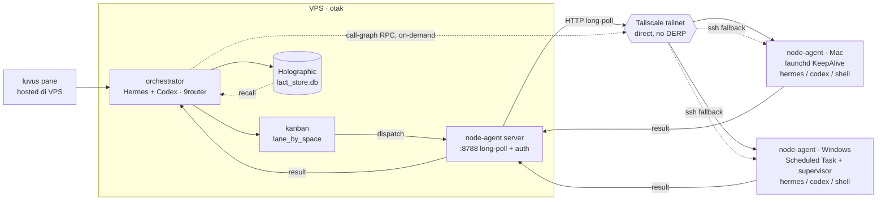

# node-agent — Otak di VPS, tangan di Mac/Windows lewat Tailscale

> agentic-flow-adit · rev 5

Orchestrator, kanban, dan memory (Holographic) tinggal permanen di VPS. Eksekusi kode jalan
di mesin lokal (Mac/Windows) lewat **node-agent** — koneksi persisten, bukan SSH tiap dispatch —
dengan SSH sebagai fallback kalau stream putus. Ini realisasi dari konsep **Spaces** yang udah
dirancang buat Hermes WebUI.

## Kenapa node-agent, bukan SSH tiap task

| Aspek | SSH per-dispatch | Node-agent (dipilih) |
|---|---|---|
| Koneksi | ~~handshake + auth ulang tiap task~~ | satu koneksi persisten, reconnect otomatis kalau putus |
| Arah koneksi | VPS → local (sering ke-block NAT/wifi kantor) | local dial keluar ke VPS (identitas tailnet stabil) |
| Transport | shell exec, teks mentah | HTTP long-poll JSON (pola sama kayak transport Go↔Hermes yang udah jalan) |
| Kalau koneksi mati | — | fallback otomatis ke SSH exec |
| Auth | — | shared-secret token `X-Node-Agent-Token` di semua endpoint |

## Alur — VPS (otak) ↔ node-agent (tangan)



**Legend**

| | |
|---|---|
| **O** | plans + delegates, nulis ke & recall dari memory |
| **K** | assign task ke space (mac/windows) berdasarkan lane |
| **S** | node-agent server — `POST /api/dispatch` route by workspace prefix, agent long-poll, token-auth |
| **NA** | node-agent — eksekusi di workspace lokal, `runJob` heuristic: shell fast-path → hermes → codex |
| **call-graph RPC** | orchestrator panggil langsung kapan aja — nggak nunggu kanban card |
| **T** | tailnet — pastiin direct via `tailscale ping`, bukan relay DERP |
| **M** | Holographic — fact_store.db, satu-satunya sumber konteks lintas mesin |

## Security — auth token

Semua endpoint `/api/*` dan `/dl/*` wajib header `X-Node-Agent-Token` (kecuali server
dijalan tanpa token — itu di-log WARNING tiap start, jangan dibiasain).

1. Generate sekali: `openssl rand -hex 32`
2. Simpan di `~/.hermes/node-agent.env` (`NODE_AGENT_TOKEN=<hex>`, chmod 600) di **setiap mesin**
   (VPS, Mac, Windows) — semua konsumen lokal (kanban-board, gateway watcher) baca dari file ini.
3. Server & agent harus pakai nilai yang sama, kalau beda semua request `401 unauthorized`.

## Quick start

VPS (server):

```sh
cd ~/apps/node-agent
./ctl.sh build
NODE_AGENT_TOKEN=<token> ./ctl.sh start     # :8788, auth aktif
curl -H "X-Node-Agent-Token: <token>" http://127.0.0.1:8788/health
```

`ctl.sh` juga serve binary agent: `./ctl.sh build-mac` / `./ctl.sh build-windows` output ke
`dist/`, di-download agent via endpoint `/dl/mac` / `/dl/windows`.

### Mac (agent, launchd KeepAlive) — single command

```sh
# dari Mac (repo di-clone / script di-sync dulu):
NODE_AGENT_TOKEN=<token-yang-sama-dengan-VPS> ./scripts/install-mac.sh
```

Script narik binary dari VPS via `/dl/mac`, nulis plist `com.adit.node-agent`, load launchd,
verifikasi registrasi. Upgrade = jalanin ulang script yang sama.

Manual (lama, masih bisa):

```sh
GOOS=darwin GOARCH=arm64 go build -o node-agent ./cmd/agent
scp node-agent <user>@100.64.0.2:.hermes/bin/node-agent
ssh mac 'launchctl load ~/Library/LaunchAgents/com.adit.node-agent.plist'
```

### Windows (agent, Scheduled Task + supervisor) — single command

```powershell
# dari Windows (PowerShell biasa, bukan admin):
cd C:\Users\<user>\apps\node-agent     # lokasi repo di-clone/sync
$env:NODE_AGENT_TOKEN = "<token-yang-sama-dengan-VPS>"
.\scripts\install-windows.ps1
```

Kalau ExecutionPolicy nge-block, jalanin sekali dulu:
`Set-ExecutionPolicy -Scope CurrentUser RemoteSigned`.

Script narik binary dari VPS via `/dl/windows` (kill exe jalan dulu biar file bisa di-swap),
persist env `NODE_AGENT_SERVER/TOKEN/ID` di User env, nulis supervisor loop
(`node-agent-supervisor.ps1` — restart exe dalam 3 detik kalau crash, setara `KeepAlive`),
daftarin Scheduled Task `NodeAgent` trigger ONLOGON, jalanin, verifikasi registrasi.

Catatan Windows:
- Agent baca `~/.hermes/workspaces.json` via `$HOME` — supervisor set `HOME=$env:USERPROFILE`
  otomatis. Buat `workspaces.json` di `%USERPROFILE%\.hermes\` dgn isi workspace Windows, contoh:

  ```json
  {"workspaces":[{"path":"C:\\Users\\<user>"}]}
  ```

- Shell fallback di Windows pakai `cmd /c` (bukan `bash -lc` — WSL bash gak punya coreutils
  lengkap dan chdir ke path Windows)
- `ONLOGON` butuh sesi user aktif; pre-login service (ONSTART + SYSTEM) di luar scope
- Uninstall: `schtasks /Delete /TN NodeAgent /F`

### Dispatch

```sh
curl -X POST http://127.0.0.1:8788/api/dispatch -H 'Content-Type: application/json' \
  -H "X-Node-Agent-Token: <token>" \
  -d '{"task_id":"t1","board":"f8-saas","message":"git status","workspace":"/Users/<user>/Development/saas"}'
curl -H "X-Node-Agent-Token: <token>" http://127.0.0.1:8788/api/results/t1
```

Route by workspace prefix: workspace Mac (`/Users/...`) → node mac, workspace Windows
(`C:\...`) → node windows. Gak match node manapun → fallback node pertama yang hidup.

Verifikasi:

```sh
# tanpa token harus 401:
curl -o /dev/null -w "%{http_code}\n" http://<vps-tailscale-ip>:8788/api/nodes
# download binary agent:
curl -H "X-Node-Agent-Token: <token>" -o node-agent http://<vps-tailscale-ip>:8788/dl/mac
```

## Workspaces

`~/.hermes/workspaces.json` (VPS+Mac synced) binds hermes kanban boards to luvus workspaces:

| id | path | apps |
|---|---|---|
| `root` | `/Users/<user>/Development` | — |
| `saas` | `/Users/.../saas` | gadjian/app, portal-hadirr, baktiku-portal |
| `bisadaya` | `/Users/.../bisadaya-monorepo` | remote `git@dev.fast-8.com:bisadaya/bisadaya-monorepo.git` |

Helper `ws` CLI (`~/.hermes/bin/ws`):

```sh
ws list              # ID | STATUS connected/disconnected | ROUTE relay/direct | LUVUS | PATH
ws ping [id]         # ssh probe per workspace
ws open <id>         # luvus workspace open <path> on Mac + verify
ws status --json     # machine-readable
```

## runJob heuristic (rev 5)

Shell meta (`;`, `|`, `&&`) or CLI prefix (`git `, `ls `, `cat `, `echo `, `pwd`, `grep `, `find `…) →
`bash -lc` (Mac) / `cmd /c` (Windows) fast (~50-100ms).
Otherwise LLM prompt → `hermes chat -q` → `codex exec` fallback.

Sebelum eksekusi prompt, agent membangun context:

1. **`ensureCodegraph(ws)`** — `.codegraph/` ada → skip (codegraph auto-sync jalan sendiri);
   binary `codegraph` ada → `codegraph init` (cap 60s, gagal = non-fatal, lanjut);
   binary tidak ada → skip (tidak ada auto-install — install manual sekali:
   `curl -fsSL https://raw.githubusercontent.com/colbymchenry/codegraph/main/install.sh | sh`).
2. **`readPrequest(ws, note)`** — prequest project, prioritas:
   (a) `PrequestNote` dari server (field `note` di `~/.hermes/workspaces.json`,
   di-match longest-prefix terhadap workspace task) → (b) `AGENTS.md` head 100 baris
   → (c) `README.md` head 100 baris.
3. Prompt final = prequest + `[codegraph status]` + task message.

Job timeout default **600s** (sebelumnya 120s — coding task multi-tool-call sering
lebih lama; override `NODE_AGENT_JOB_TIMEOUT`, di-set 600 di launchd Mac).

### Prequest note (workspaces.json)

```json
{"workspaces":[{"id":"saas","path":"/Users/<user>/Development/saas","host":"mac-tailscale",
  "note":"PHP legacy + jQuery. Entry cs.gadjian/www, controller di app/controller. Jangan commit langsung."}]}
```

Server (`cmd/server/main.go` `workspaceNoteFor`) meng-inject note ke
`DispatchRequest.PrequestNote` sebelum job masuk queue agent — agent tidak perlu
baca workspaces.json sendiri.

### Review gate (kanban side)

Result sukses dari agent TIDAK langsung `done` — kanban-board memindahkan task ke
`review`; approve (commit / commit&push) dijalankan kanban-board via SSH.
Agent tidak pernah commit/push dari prompt dispatch. Detail: README kanban-board
(`~/apps/kanban-board/README.md`) dan
`docs/specs/2026-09-07-single-dispatcher-review-gate-design.md` di repo kanban-board.
Job timeout default 120s (`NODE_AGENT_JOB_TIMEOUT` override, detik) — job hang gak
wedge agent.

| test | kind | duration |
|---|---|---|
| `echo;pwd;ls gadjian` | shell | 44ms |
| `git branch --show-current` | shell | 90ms |
| `list files in current directory` | hermes | 57.7s |

## Install manifest

```json
{
  "manifest": [
    { "name": "hermes-agent",          "repo": "NousResearch/hermes-agent",        "role": "orchestrator",   "status": "installed" },
    { "name": "holographic-memory",    "repo": "bysc1000/holographic-memory",      "role": "memory-plugin",  "status": "installed" },
    { "name": "codex",                 "repo": "openai/codex",                     "role": "worker",         "status": "installed" },
    { "name": "9router",               "repo": "decolua/9router",                  "role": "model-router",   "status": "installed" },
    { "name": "luvus",                 "repo": "RizRiyz/luvus",                    "role": "multiplexer",    "status": "installed" },
    { "name": "ponytail",              "repo": "DietrichGebert/ponytail",          "role": "skill",          "status": "installed" },
    { "name": "caveman",               "repo": "JuliusBrussee/caveman",            "role": "skill",          "status": "installed" },
    { "name": "call-graph",            "repo": "colbymchenry/codegraph",           "role": "skill",          "status": "installed" },
    { "name": "worktrees",             "repo": "tanvesh01/issue-workflow",         "role": "skill",          "status": "skipped (repo empty)" },
    { "name": "node-agent",            "repo": "adityahimaone/node-agent",         "role": "custom",         "status": "installed (this repo)" }
  ]
}
```

## Skills — siapa jalan di mana

| Skill | Jalan di | Perannya |
|---|---|---|
| ponytail | node-agent, sebelum kirim hasil | saring dulu — kalau cukup `lru_cache`, jangan bikin kelas custom. Ngirit round-trip ke VPS |
| caveman `full` | payload hasil | hasil node-agent → orchestrator terse. Ngurangin ukuran payload lewat tailnet, bukan cuma hemat context |
| call-graph | node-agent (butuh akses codebase lokal) | `codegraph_explore` + LSP lokal, yang dikirim balik cuma graph terstruktur, bukan log traversal mentah |
| worktrees | node-agent | satu worktree per kanban card yang di-assign ke space itu — task paralel nggak tabrakan |
| luvus | VPS | kontrol pane, di-attach dari Mac/Windows/HP via Tailscale ssh |

## Bikin cepat — checklist Tailscale

1. `tailscale ping <mesin>` — pastikan "direct", bukan "via DERP". Kalau relay, cek `tailscale netcheck` buat NAT type.
2. Node-agent dial keluar ke VPS, bukan VPS masuk ke local — local machine biasanya di belakang NAT yang lebih ribet.
3. MagicDNS aktif — alamat pakai nama mesin, bukan IP tailnet yang bisa berubah.
4. HTTP plaintext di atas interface Tailscale — WireGuard udah encrypt, TLS tambahan cuma buang CPU/latency buat setup single-user. Auth token nutup celah otorisasi.
5. Auto-reconnect dengan backoff di node-agent; orchestrator tandai space offline & switch ke SSH fallback kalau di atas threshold.

## Build

```sh
# VPS server
go vet ./... && GOMAXPROCS=1 GOGC=20 go build -o node-agent-server ./cmd/server

# Mac agent (dari VPS, cross-compile) — output ke dist/, di-serve /dl/mac
GOOS=darwin GOARCH=arm64 GOMAXPROCS=1 GOGC=20 go build -o dist/node-agent-darwin-arm64 ./cmd/agent

# Windows agent (dari VPS, cross-compile) — output ke dist/, di-serve /dl/windows
GOOS=windows GOARCH=amd64 GOMAXPROCS=1 GOGC=20 go build -o dist/node-agent-windows-amd64.exe ./cmd/agent
```

Stack: Go 1.23, chi, HTTP JSON long-poll (no protoc). Server di VPS (nohup via `ctl.sh`
atau pm2 — token wajib masuk env), launchd di Mac, Scheduled Task di Windows, SSH alias
`mac-tailscale` / `windows-tailscale` untuk file ops.

---

rev 5 — prequest injection (workspaces.json note → DispatchRequest.PrequestNote),
ensureCodegraph + readPrequest sebelum eksekusi, job timeout 120s→600s. Sukses → kolom
review di kanban (approve commit/commit&push oleh kanban-board via SSH), agent tidak pernah
commit sendiri.

rev 4 — token auth semua endpoint, result TTL, /dl installer endpoints, Mac+Windows single-command
installers, job timeout, honest heartbeat. Otak di VPS, tangan di node-agent (Mac/Windows),
ssh fallback, no ollama, no opencode.
Design spec: [docs/agentic-flow-adit.html](docs/agentic-flow-adit.html)
