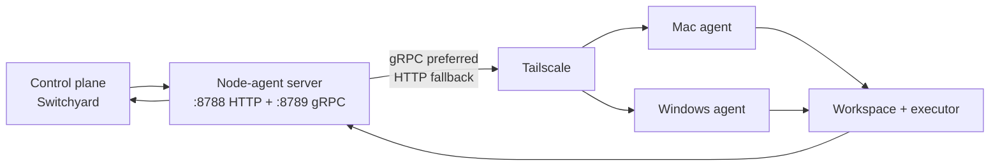
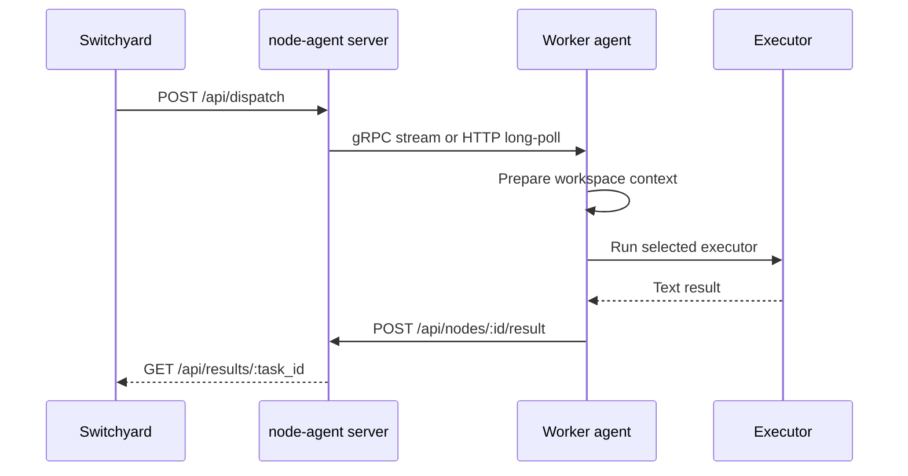

# node-agent

Worker service for running tasks on hosts that own the source code. The node-agent server runs on the VPS. Agents run on Mac or Windows. Agents open outbound connections to the VPS, so the VPS does not need inbound access to local machines.

This repository is the execution plane. [Switchyard](https://github.com/adityahimaone/switchyard) is the control plane: it stores task intent, selects a workspace and executor, then dispatches work to this service.

## Architecture


```mermaid
flowchart LR
  C[Control plane<br/>Switchyard] --> S[Node-agent server<br/>:8788 HTTP + :8789 gRPC]
  S -->|gRPC preferred<br/>HTTP fallback| T[Tailscale]
  T --> M[Mac agent]
  T --> W[Windows agent]
  M --> X[Workspace + executor]
  W --> X
  X --> S
  S --> C
```


```mermaid
sequenceDiagram
  participant K as Switchyard
  participant S as node-agent server
  participant A as Worker agent
  participant E as Executor

  K->>S: POST /api/dispatch
  S->>A: gRPC stream or HTTP long-poll
  A->>A: Prepare workspace context
  A->>E: Run selected executor
  E-->>A: Text result
  A->>S: POST /api/nodes/:id/result
  S-->>K: GET /api/results/:task_id
```

The server keeps the queue and results in memory. An agent registers, sends heartbeats, receives one job, executes it, and posts the result back. Switchyard remains responsible for board state, retries, review, commit, and push.

## One-command install & update

Updating an agent never asks for the token again — the updater reads the token and server URL from the worker's own install (LaunchAgent config on Mac, User environment on Windows). First install is one command too, and it is the only time the token is typed:

```sh
# first install
curl -fsSL http://<VPS_TAILSCALE_IP>:8788/install/mac | env NODE_AGENT_TOKEN=<token> bash
powershell -NoProfile -Command "$env:NODE_AGENT_TOKEN='<token>'; iex (irm http://<VPS_TAILSCALE_IP>:8788/install/windows)"

# upgrade — no token
curl -fsSL http://<VPS_TAILSCALE_IP>:8788/update/mac | bash
powershell -NoProfile -Command "iex (irm http://<VPS_TAILSCALE_IP>:8788/update/windows)"
```

The shared token lives in `~/.hermes/node-agent.env` (mode `0600`) on the server and every worker; Switchyard provisions it on first Overview view. Set `NODE_AGENT_PUBLIC_URL` on the server so the served installers default to the right address. What the installers do under the hood: the sections below.

When the server is unreachable (VPN down, VPS offline), the scripts fall back to a release URL — a GitHub release download directory. The server bakes `NODE_AGENT_GITHUB_RELEASE` into the scripts it serves; a worker can override it with `NODE_AGENT_RELEASE_URL`. The value is a download base: the scripts fetch `node-agent-darwin-arm64` / `node-agent-windows-amd64.exe` from it, so publish release assets under those exact names. This repository's releases do (`github.com/adityahimaone/node-agent/releases`), so the fallback is live out of the box.

## Executors

| Executor | Binary | Mode | Notes |
|---|---|---|---|
| `hermes` | `hermes` | `hermes chat -q` | Uses `HERMES_WORKSPACE` |
| `codex` | `codex` | `codex exec --full-auto` | Non-interactive coding tasks |
| `dsh` | `dsh` | `--profile headless --json` | DeepSeek Harness session; isolated `DSH_HOME` |
| `commandcode` | `cmd`, `cmdc`, or `command-code` | `-p ... --yolo` | `cmdc` is the Windows alias |
| `claude` | `claude` | `-p --output-format json --permission-mode bypassPermissions` | Claude Code; per-card session continuity via `--resume`; trusted nodes only |
| `omp` | `omp` | `-p --auto-approve --mode json` | oh-my-pi; session continuity via `--resume` |
| `shell` | OS shell | `bash -lc` or `cmd /c` | `command` only; `body` is description — empty `command` rejected |
| `auto` | Available capability | Hermes, then Codex, then CommandCode, then omp | Compatibility mode |

The agent does not infer the shell from prompt contents. The dispatcher sends the executor explicitly. Shell supports `execution_mode=direct` (the `command` field is executed once) and `execution_mode=agentic` (a read-only planner selects one command at a time, the worker executes it through shell + RTK, and repeats within `max_iterations`). Agentic mode receives task intent in `message`; destructive command patterns are blocked and the final result remains review-gated by Switchyard.

### CommandCode

CommandCode runs through its headless CLI:

```sh
cmd -p "<prompt>" --yolo --skip-onboarding --output-format text
```

`--yolo` allows file edits and shell commands. Use this executor only on trusted nodes. The node-agent requests text output so task results stay readable.

References: [headless mode](https://commandcode.ai/docs/headless) and [CLI reference](https://commandcode.ai/docs/reference/cli).

### omp (oh-my-pi)

[`omp`](https://omp.sh) is a coding agent with a native Rust core, shipped as a
single cross-platform binary. The worker drives it headlessly:

```sh
omp -p --auto-approve --mode json "<prompt>"
omp -p --auto-approve --mode json --resume <session-id> "<prompt>"
```

- `--mode json` makes the run emit NDJSON so the worker can prove session
  identity. Unlike CommandCode there is no text fallback: a successful run with
  no session id fails with `omp_session_missing:` rather than binding a guessed
  id.
- `--auto-approve` is required because a headless worker cannot answer an
  interactive approval prompt. It allows file edits and shell commands, so use
  this executor only on trusted nodes.
- The binary is `omp` on macOS/Linux and `omp.exe` on Windows; no alias needed.
  The worker probes it but never installs it.

omp returns no turn sequence, so `last_turn_seq` stays nil and Switchyard relies
on its run-ownership fence. The worker does not pass `--model`: omp resolves the
model from the host's own config, so a board-level `model` is ignored for this
executor.

Full contract, install steps, and troubleshooting:
[docs/omp-harness.md](docs/omp-harness.md).

### Claude Code CLI

Claude Code is an explicit worker executor, not part of the `auto` fallback.
Install it using Anthropic's [platform-native CLI instructions](https://code.claude.com/docs/en/overview), then authenticate as the same OS account that runs node-agent. The node-agent installers deploy only the worker; they do not install Claude Code or provision Anthropic credentials.

The worker runs a terminal prompt without an interactive UI and requests JSON result metadata:

```sh
claude -p --output-format json --permission-mode bypassPermissions "<prompt>"
claude -p --output-format json --permission-mode bypassPermissions --resume <session-id> "<prompt>"
```

`bypassPermissions` allows unattended file edits and shell commands. Use this only on registered, trusted worker hosts. The first run omits `--resume`; its terminal result must return `session_id`. A successful result without that ID fails closed with `claude_session_missing:`. Continuations must resume the dispatched ID and may not fall back to a cold session. Claude emits no turn cursor or workspace identity, so Switchyard's `current_run_id` fence protects against stale results.

Restart node-agent after installing/authenticating Claude Code, then verify `/api/nodes` lists `claude` and `versions.claude`. See the [Claude Code worker contract](docs/claude-code-harness.md) and [Switchyard continuity contract](https://github.com/adityahimaone/switchyard/blob/main/docs/features/claude-code-executor.md).

### DeepSeek Harness

`dsh` runs the DeepSeek Harness headless profile on the workspace host:

```sh
dsh --profile headless --json
```

A continuation adds `--session-id <id>` and resumes the same session; the first
run omits it. The worker reads the session ID and cwd from the emitted `session`
event and fails the run with `dsh_session_missing` when `--json` produces no
session event, rather than reporting silent success.

`dsh` is a Node launcher and launchd starts the worker with a minimal `PATH`, so
the worker prepends `/opt/homebrew/bin` for every DSH invocation, including the
`--version` health check.

Agent runs use an isolated home (`~/.dsh-nodeagent`, overridable with
`NODE_AGENT_DSH_HOME`), keeping their session locks separate from the `dsh web`
daemon's. Finished sessions are mirrored back into `~/.dsh` and registered in
its workspace registry so `dsh web` can list them. Because DSH write handles are
`flock(2)` leases that the installed build never expires, retrying a conflict
does not help — isolating the home does.

Full contract, session identity rules, and troubleshooting:
[docs/dsh-harness.md](docs/dsh-harness.md).

## Register and capabilities

At startup the agent finds available binaries and sends capabilities:

```json
{
  "node_id": "mac",
  "hostname": "worker-mac",
  "version": "0.3.0",
  "workspaces": ["/Users/<user>/Development"],
  "executors": ["hermes", "codex", "dsh", "commandcode", "claude", "omp", "shell"],
  "versions": {"commandcode": "...", "claude": "...", "omp": "omp/18.4.0", "tailscale": "1.102.2 (Running)"}
}
```

The server accepts an explicit executor only when it is advertised by the selected node. If multiple nodes provide the same workspace, executor capability is also used for selection.

`versions` is what the Switchyard Overview's Integration health card reads. Each entry is the binary's `--version` output; `tailscale` is probed through `tailscale status --json`, so its value carries the tailnet state — only `(Running)` reads as connected. A binary that exists but fails its probe reports `probe failed`.

## Dispatch API

All `/api/*` and `/dl/*` endpoints use `X-Node-Agent-Token` when token authentication is configured on both server and agent. The `/update/*` and `/install/*` script endpoints are the exception — they are secret-free: the updater reads the token from the worker's own install, and the installer takes its token from the caller's environment.

### Send an AI job

```sh
curl -X POST http://<VPS_TAILSCALE_IP>:8788/api/dispatch \
  -H 'Content-Type: application/json' \
  -H "X-Node-Agent-Token: <token>" \
  -d '{
    "task_id": "t1",
    "board": "saas",
    "message": "Fix login validation",
    "workspace": "/Users/<user>/Development/saas",
    "executor": "commandcode"
  }'
```

### Internal shell dispatch

Switchyard creates tasks with `executor: "shell"` and a dedicated `command`. The task dialog exposes `Shell Command` separately from the description; `body` never becomes the command:

```json
{
  "task_id": "t2",
  "board": "saas",
  "message": "generated by orchestrator",
  "workspace": "/Users/<user>/Development/saas",
  "executor": "shell",
  "command": "git status && pnpm test"
}
```

DSH dispatches carry session continuity fields. Switchyard sends
`dsh_workspace_id`, `dsh_session_id`, `last_turn_seq`, `last_comment_id`,
`run_id`, and `session_continuation`; the worker returns `dsh_workspace_id`,
`dsh_session_id`, and the highest consumed `last_turn_seq`:

```json
{
  "task_id": "t3",
  "board": "saas",
  "message": "Continue from the last review comment",
  "workspace": "/Users/<user>/Development/saas",
  "executor": "dsh",
  "dsh_session_id": "session-<uuid>",
  "session_continuation": true
}
```

See [docs/dsh-harness.md](docs/dsh-harness.md) for what the worker guarantees.

POST /api/dispatch body accepts `conversation_id`, `append_only`, and
`context_window`. When `conversation_id` is empty the agent resolves one per
workspace+executor. `append_only=false` clears history before the prompt.
The agent stores messages under `$HOME/.node-agent/conversations/*.json`.
Hermes receives context via prompt assembly; codex/commandcode/omp remain
stateless for now.

Fetch the result:

```sh
curl -H "X-Node-Agent-Token: <token>" \
  http://<VPS_TAILSCALE_IP>:8788/api/results/t1
```

Result fields include `success`, `output`, `error`, and `duration_ms`. Dispatch acknowledgements may include `transport` and `delivery_id`; Switchyard uses them for flow diagnostics and idempotent result handling.

### Endpoints

| Method | Path | Purpose |
|---|---|---|
| GET | `/health` | Health and node list |
| GET | `/api/nodes` | Node capabilities and status |
| POST | `/api/nodes/register` | Register an agent |
| POST | `/api/nodes/{id}/heartbeat` | Update idle or busy state |
| GET | `/api/nodes/{id}/poll` | Long-poll for a job |
| POST | `/api/nodes/{id}/result` | Submit a job result |
| POST | `/api/dispatch` | Queue a job by workspace |
| GET | `/api/results/{task_id}` | Fetch a result |
| GET | `/api/workspaces` | Server workspaces and node status |
| GET | `/dl/mac` | Download the Mac binary |
| GET | `/dl/windows` | Download the Windows binary |
| GET | `/update/mac` | One-command Mac updater script (secret-free) |
| GET | `/update/windows` | One-command Windows updater script (secret-free) |
| GET | `/install/mac` | Mac installer script (secret-free) |
| GET | `/install/windows` | Windows installer script (secret-free) |

## Context and output optimization

Before starting an AI executor, the agent prepares context:

1. `ensureCodegraph(ws)` uses an existing `.codegraph/` index or runs `codegraph init` with a 60-second limit.
2. `PrequestNote` from Switchyard/workspace registry takes priority.
3. When the note is empty, the agent reads the first 100 lines of `AGENTS.md`, then `README.md`.
4. The final AI prompt combines prerequisites, codegraph status, and the task message.

Shell is a separate fast path:

- default: execute only `command` through `bash -lc` (or `cmd /c` on Windows);
- `body` is descriptive text and is never executed;
- empty/whitespace `command` is rejected by Switchyard and node-agent;
- `NODE_AGENT_SHELL_PREFLIGHT=1` exposes codegraph/prequest through `NODE_AGENT_CODEGRAPH_STATUS` and `NODE_AGENT_PREQUEST`, without changing command text;
- RTK rewrite runs within bounded 800 ms checks; `NODE_AGENT_SHELL_CAVEMAN=1` may compact output over 8 KiB with a 2-second fail-open cap.

The pipeline reduces model context through:

- codegraph — local structural index for AI executors;
- RTK — shell command/output reduction;
- caveman — optional shell result compression, gated by environment.

Codegraph failure is non-fatal. Jobs can run without an index. Shell preflight and output compaction are opt-in, not required for basic shell execution.

## Configuration

Server environment:

```sh
NODE_AGENT_ADDR=:8788
NODE_AGENT_GRPC_ADDR=:8789
NODE_AGENT_GRPC_ENABLED=1
NODE_AGENT_TOKEN=<shared-secret>
NODE_AGENT_DIST_DIR=./dist
NODE_AGENT_PUBLIC_URL=http://<VPS_TAILSCALE_IP>:8788
NODE_AGENT_GITHUB_RELEASE=https://github.com/adityahimaone/node-agent/releases/latest/download
```

`NODE_AGENT_PUBLIC_URL` is the URL the server advertises: the installers it
serves have it baked in as their default server, so a copied command works
without editing. `NODE_AGENT_GITHUB_RELEASE` is the fallback download base
the served scripts use when the server itself is unreachable. The token
itself resolves per request — `~/.hermes/
node-agent.env` first (the same file Switchyard reads and provisions), the
`NODE_AGENT_TOKEN` environment variable second — so a token created or rotated
in the file takes effect without a server restart.

Agent transport:

```sh
NODE_AGENT_TRANSPORT=auto             # auto | grpc | http
NODE_AGENT_GRPC_TARGET=<VPS_TAILSCALE_IP>:8789
```

`auto` prefers gRPC when `NODE_AGENT_GRPC_TARGET` is set. Connection or stream failure falls back to HTTP long-poll. `grpc` fails loudly when gRPC is unavailable. `http` forces compatibility mode. Phase 1 gRPC uses HTTP/2 with a JSON codec and shared token metadata. Keep port `8789` private to the tailnet.

Agent environment:

```sh
NODE_AGENT_SERVER=http://<VPS_TAILSCALE_IP>:8788
NODE_AGENT_TOKEN=<shared-secret>
NODE_AGENT_ID=mac
NODE_AGENT_JOB_TIMEOUT=600
NODE_AGENT_NO_RTK=1
```

`NODE_AGENT_NO_RTK=1` disables `rtk` rewriting for shell executors. Without it, the agent tries `rtk hook check` and then `rtk rewrite`, each with an 800 ms limit, and uses the original command when rewriting fails. The executable name remains `rtk`.

DeepSeek Harness variables:

```sh
NODE_AGENT_DSH_HOME=$HOME/.dsh-nodeagent   # isolated session home (default)
NODE_AGENT_DSH_PUBLISH=0                   # skip mirroring sessions into ~/.dsh
NODE_AGENT_DSH_WORKSPACE_REGISTRATION=0    # skip workspace registry writes
NODE_AGENT_DSH_WEB_URL=http://127.0.0.1:3080/
NODE_AGENT_DSH_CONFLICT_RETRIES=30
NODE_AGENT_DSH_CONFLICT_DELAY_MS=1000
```

Leave `NODE_AGENT_DSH_HOME` unset to keep the default isolated home. Do not
point it at `~/.dsh` — that restores the lock contention with `dsh web`.

The token must match on the server and every agent. Store it in `~/.hermes/node-agent.env` with file mode `0600`. Both the server and Switchyard resolve that file directly, so it is the single source of truth — no shell exports, and rotation needs no restart.

## Install the server on the VPS

```sh
cd ~/apps/node-agent
./ctl.sh build
NODE_AGENT_TOKEN=<token> ./ctl.sh start
curl -H "X-Node-Agent-Token: <token>" http://<VPS_TAILSCALE_IP>:8788/health
```

`ctl.sh` also copies the operator scripts (installers and updaters) into `dist/`
on every start and cross-builds worker binaries; both are served through the
HTTP endpoints above.

## Install the Mac agent

VPS server upgrades do not replace the agent binary running on Mac. Install the Mac worker separately:

```sh
NODE_AGENT_TOKEN=<same-token-as-VPS> ./scripts/install-mac.sh
```

The installer downloads the binary, writes a KeepAlive LaunchAgent, and verifies registration. The one-command install and upgrade variants are above.

## Install the Windows agent

```powershell
cd C:\Users\<user>\apps\node-agent
$env:NODE_AGENT_TOKEN = "<same-token-as-VPS>"
.\scripts\install-windows.ps1
```

The installer uses a Scheduled Task at logon and a supervisor to restart the binary when it exits. The Windows CommandCode alias is `cmdc`; `cmd` is the built-in command shell. The one-command install and upgrade variants are above.

## Workspace routing

The dispatch endpoint matches the task's workspace against prefixes advertised by agents:

- `/Users/...` usually routes to a Mac node;
- `C:\...` usually routes to a Windows node;
- when multiple nodes share a workspace, the longest prefix wins and executor capability filters the candidates — a node only receives a dispatch for an executor it advertised;
- when a task carries no workspace, dispatch picks an online node (lowest node id); this is unrelated to the `auto` executor, which resolves an *executor* from installed binaries.

Rejections:

- `409 executor unavailable on node(s) owning workspace: <executor>` — the workspace has owners, but none advertises the requested executor;
- `409 no node owns workspace "<ws>" (registered: ...)` — no node advertises that workspace prefix;
- `503 no nodes available` — the registry is empty, or every node is offline.

Agent workspaces are read from `~/.hermes/workspaces.json`:

```json
{"workspaces": [{"path": "/Users/<user>/Development"}]}
```

Switchyard uses the same file as its workspace source of truth. Keep workspace IDs, host, OS, notes, and unknown metadata intact when editing it.

## Timeout and status

Default job timeout is 600 seconds (`NODE_AGENT_JOB_TIMEOUT`). Timed-out jobs are cancelled and returned as failures. Heartbeats use `idle` or `busy` so the server does not send work to a busy agent.

Shell jobs in `execution_mode=agentic` get a different default, **1200 seconds** (`NODE_AGENT_SHELL_AGENTIC_TIMEOUT`), because the planner loop runs several commands per iteration. A single dispatch may also carry its own `timeout_s`, which overrides both defaults for that job only — this is how a long verification run gets a longer budget without making every hung job wait for it. The agent clamps that override to a 60s floor and a 6h ceiling.

## Artifacts

A run that produces files (verification screenshots, an accessibility report) can have them collected automatically. When a dispatch carries `artifact_dir`, the agent uploads everything in that directory to the node-agent server before posting its result, and reports the metadata back in `artifacts`. The bytes stay on the node; Switchyard pulls them over the token-authenticated client and stores them as task attachments.

| Variable | Default | Purpose |
|---|---|---|
| `NODE_AGENT_ARTIFACT_DIR` | `$TMPDIR/node-agent-artifacts` | Where the server stores artifacts, one directory per task. |
| `NODE_AGENT_JOB_ARTIFACT_DIR` | *(unset)* | Set per job from `artifact_dir`; the agent uploads from here. |

Limits: 5 MB per file, 30 MB per task, swept after 7 days. Uploads are treated as untrusted — the declared content type is ignored in favour of sniffing the bytes, the stored filename is generated rather than taken from the upload, and a client-supplied path never reaches the filesystem. Files outside the image/PDF allowlist are rejected, so a `.zip` will not be stored.

The agent never commits or pushes as part of a Switchyard dispatch. Switchyard fetches the diff and performs approval through its review gate.

## Build and test

Server and worker builds are separate. Building on the VPS does not replace an agent binary already running on Mac or Windows.

```sh
go test ./...
go vet ./...

go build -o node-agent-server ./cmd/server

GOOS=darwin GOARCH=arm64 go build -o dist/node-agent-darwin-arm64 ./cmd/agent
GOOS=windows GOARCH=amd64 go build -o dist/node-agent-windows-amd64.exe ./cmd/agent
```

## Troubleshooting

### `401 unauthorized`

Verify `NODE_AGENT_TOKEN` matches on server and agent. Verify the client sends `X-Node-Agent-Token`.

### `executor unavailable on node`

Install the executor binary on the worker host and restart node-agent so registration capabilities refresh. Check `/api/nodes`.

### Node registered but workspace is not routed

Verify the path in `workspaces.json` is a prefix of the task path. Slash differences, drive-letter differences, or an incorrect parent workspace can prevent a match.

### CommandCode fails to start

Linux and macOS require `cmd` or `command-code`. Windows requires `cmdc` or `command-code`. Run `cmd --version`, `cmdc --version`, or `command-code --version` locally as the service user.

### `omp_unavailable:` or an omp run that makes no edits

`omp_unavailable:` means the binary is not on the worker's PATH. Run
`omp --version` as the service user. The worker probes `omp` but never installs
it:

```sh
# macOS / Linux
curl -fsSL https://omp.sh/install | sh
```

```powershell
# Windows
irm https://omp.sh/install.ps1 | iex
```

If the installer aborts with a `Bun 1.3.14 or newer is required` error, the host
has an older `bun` (for example a bundled Kiro-Cli copy). Skip the source path
and take the prebuilt binary:

```powershell
& ([scriptblock]::Create((irm https://omp.sh/install.ps1))) -Binary
```

A run that starts but edits nothing usually means no provider is configured —
omp exits early with `No models available`. omp keeps credentials in its own
store, **not** in the node-agent environment, so a host with working `dsh` and
`codex` can still have none usable for omp. Run `omp setup` as the service user,
or put a provider key (`ANTHROPIC_API_KEY`, `OPENAI_API_KEY`, …) into the service
environment and restart. The worker does not pass `--model`, so a board-level
`model` is ignored for omp.

Restart the worker after installing so it re-advertises its capabilities.

### `dsh_session_conflict`

Something else owns the session's DSH write handle — normally `dsh web` running
on the same home. Confirm the agent uses the isolated home
(`lsof -p <worker-pid> | grep session.lock`) instead of tuning retries.
`NODE_AGENT_DSH_CONFLICT_RETRIES` only buys time; it does not release a foreign
lock.

### `dsh_unavailable: DeepSeek Harness (dsh) not installed or not on PATH`

Install `@deepseek-ai/dsh` on the worker host and restart node-agent so
capabilities refresh. Verify with `dsh --version` under the minimal environment
launchd provides — `dsh` is a Node launcher and needs Homebrew on `PATH`.

### DSH sessions are missing from `dsh web`

Sessions live in the isolated home until the worker publishes them. Check that
`NODE_AGENT_DSH_PUBLISH` is not `0` and that the worker log shows
`dsh session publish: mirrored session ...`. A mirrored transcript without a
registry entry still does not appear — see
[docs/dsh-harness.md](docs/dsh-harness.md).

## Related repositories and references

- [Switchyard](https://github.com/adityahimaone/switchyard) — control plane, dispatcher, and review gate
- [CommandCode CLI reference](https://commandcode.ai/docs/reference/cli)
- [CommandCode headless mode](https://commandcode.ai/docs/headless)
- [omp (oh-my-pi)](https://omp.sh) — coding agent with the IDE wired in
- [omp CLI reference](https://omp.sh/docs/cli)
- [omp executor contract](docs/omp-harness.md) — invocation, session identity, install, troubleshooting
- [DeepSeek Harness executor contract](docs/dsh-harness.md) — session identity, isolated home, publishing
- [RTK](https://github.com/rtk-ai/rtk) — command output reduction
- [Caveman](https://github.com/JuliusBrussee/caveman) — result compression target
